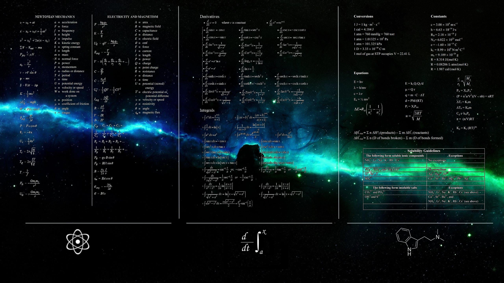

  

<h1 align="center">

</h1>

🔭 Pluviophile, dreamer of physics and stars  
🤖 Shaping robots, AIML visions, and engineering marvels  
🚀 Currently crafting <b>Kanada</b> & <b>Rakshini</b> — wander further through my <a href="[https://drive.google.com/file/d/1QFkUAB62Wj4gwryiDh8rsH-F6zeCQXlh/view?usp=drive_link](https://drive.google.com/file/d/1jmUFYncn4j-JQnSXwQ_baZsRqkFsGmFg/view?usp=drive_link)" target="_blank"><b>Resume</b></a> 🌌

    

  

